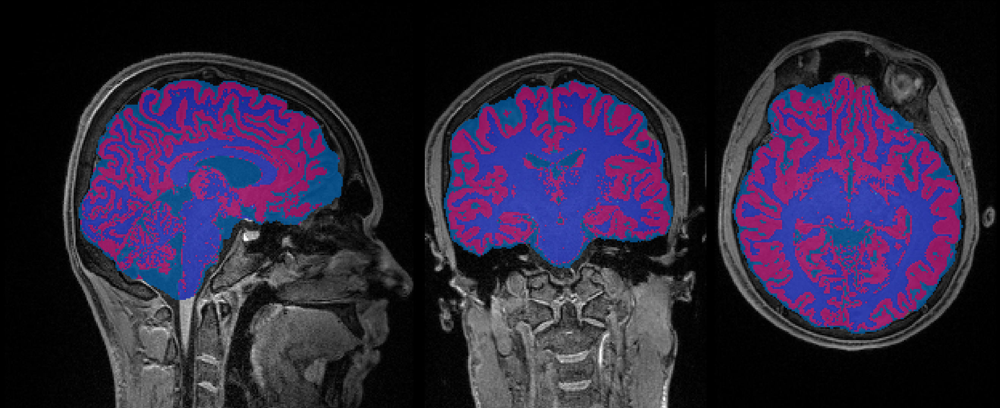
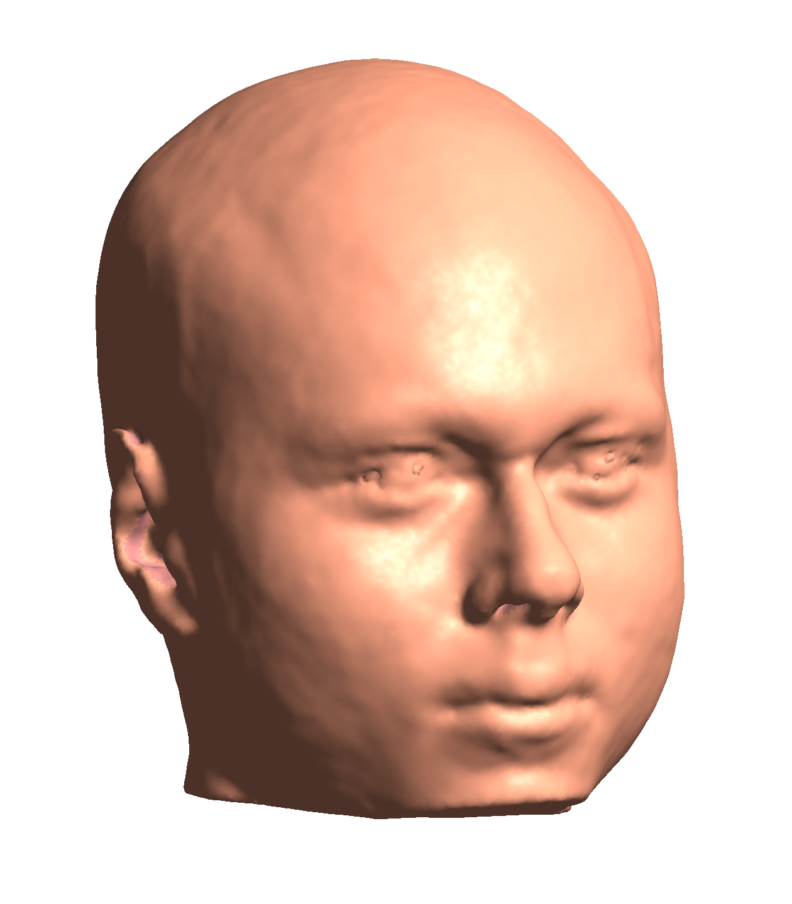
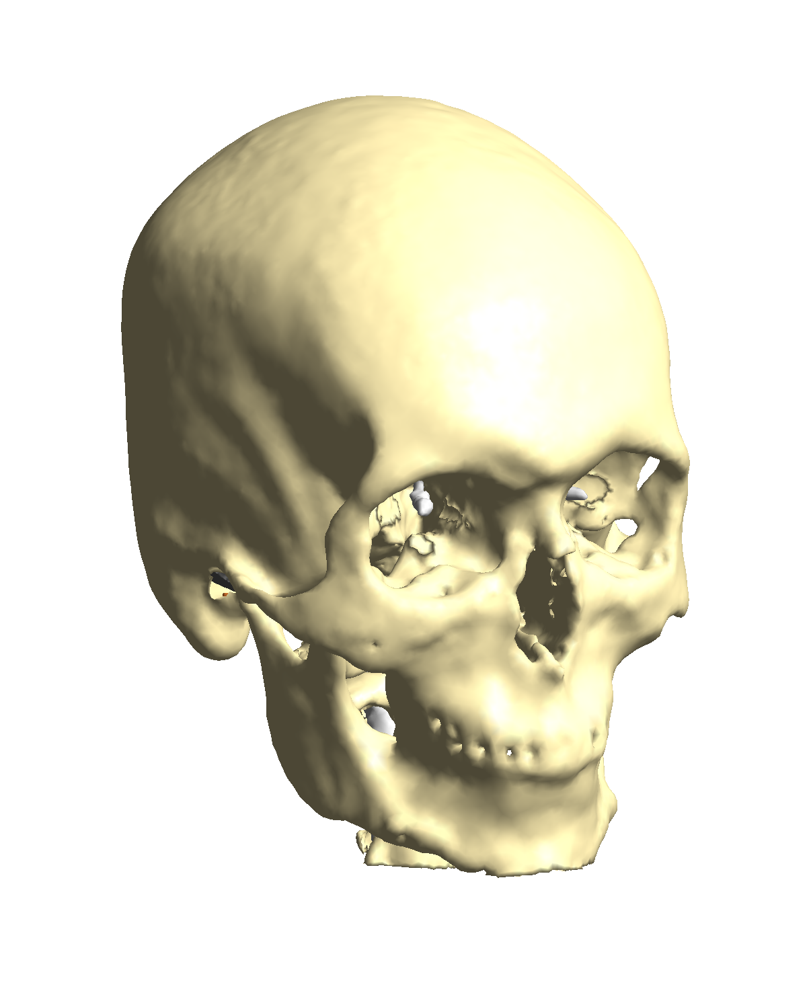
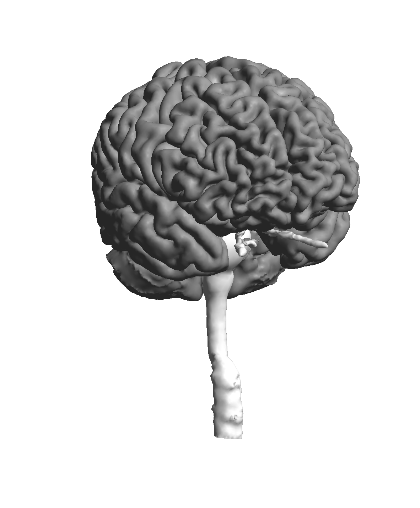
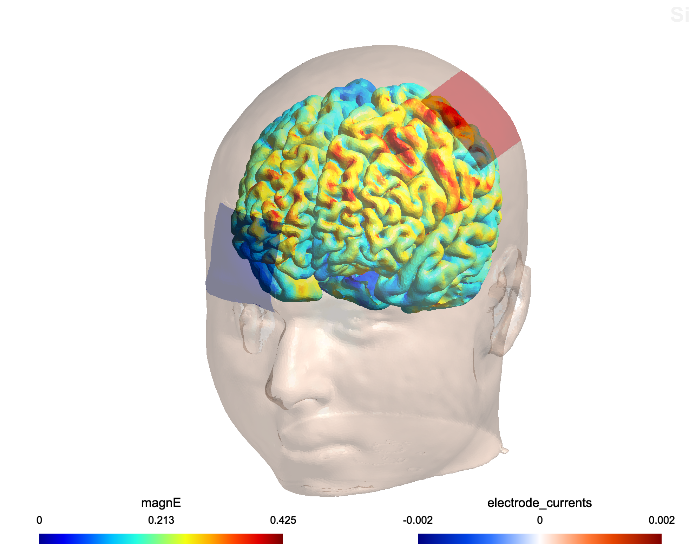

# Patient-Specific 3D Head Model & tDCS Simulation

A full pipeline for building a subject-specific 3D head model from a structural MRI and simulating transcranial direct current stimulation (tDCS) electric fields. Built using **FSL** and **SimNIBS 4.6**, applied to my own T1-weighted MRI scan.

---

## What is tDCS?

Transcranial direct current stimulation (tDCS) delivers weak electrical currents through scalp electrodes to modulate cortical excitability. To understand *where* and *how much* current reaches specific brain regions, computational models are needed, and those models require an accurate, subject-specific representation of the head's geometry and tissue conductivities.

---

## Pipeline

```
T1 MRI (1mm isotropic)
    │
    ├── FSL
    │   ├── fslreorient2std   → standard orientation
    │   ├── robustfov         → remove neck
    │   ├── BET               → brain extraction
    │   └── FAST              → CSF / GM / WM segmentation
    │
    └── SimNIBS charm
        ├── SAMSEG            → 5-tissue whole-head segmentation
        ├── TopoFit           → cortical surface reconstruction
        ├── MMG               → tetrahedral FEM mesh
        └── FEM solver        → E-field simulation
```

### FSL — Brain segmentation

FSL preprocesses the T1 and segments brain tissue into three classes. The brain extraction (BET) and FAST segmentation are used for neuroimaging analysis and serve as an independent QC reference for the SimNIBS output.

<p align="center">
  
  <br><em>FAST tissue segmentation: gray matter (pink), white matter (blue), CSF (teal)</em>
</p>

### SimNIBS charm — 3D head model

SimNIBS `charm` performs a full 5-tissue segmentation of the entire head (scalp, cortical bone, cancellous bone, CSF, GM, WM) and generates a tetrahedral finite element mesh for electromagnetic simulation.

<p align="center">
  
  
  <br><em>Left: scalp surface mesh &nbsp;|&nbsp; Right: cortical bone shell</em>
</p>

<p align="center">
  
  <br><em>GM/WM cortical surface with brain stem</em>
</p>

### tDCS Simulation — C3/Fp2 montage

A standard tDCS montage was simulated: **anode at C3** (left primary motor cortex) and **cathode at Fp2** (right supraorbital), 2 mA, 5×5 cm rectangular electrodes.

<p align="center">
  
  <br><em>Electric field magnitude (V/m) on the cortical surface. Peak field under C3 electrode.</em>
</p>

**E-field results in gray matter:**

| Metric | Value |
|---|---|
| Peak (99.9th percentile) | 0.41 V/m |
| 99th percentile | 0.33 V/m |
| 95th percentile | 0.27 V/m |
| Focality (75% of peak) | ~12,500 mm³ |

Values are consistent with published tDCS literature (0.2–0.5 V/m at 2 mA).

---

## Requirements

- [FSL](https://fsl.fmrib.ox.ac.uk/fsl/fslwiki) — installed at `~/fsl`
- [SimNIBS 4.6](https://simnibs.github.io/simnibs/) — installed at `~/Applications/SimNIBS-4.6`

> **macOS Apple Silicon note:** SimNIBS charm deadlocks with multiple OpenMP threads. `OMP_NUM_THREADS=1` and `KMP_DUPLICATE_LIB_OK=TRUE` are required and are already set in `pipeline/02_simnibs_charm.sh`.

---

## Usage

```bash
# 1. FSL preprocessing (~5 min)
bash pipeline/01_fsl_preprocess.sh <T1.nii> <output_dir>

# 2. SimNIBS head model (~3–5 hours)
bash pipeline/02_simnibs_charm.sh <subject_id> <T1.nii> <output_dir>

# 3. tDCS simulation (~5–15 min)
cd <output_dir>
simnibs_python ../pipeline/04_tdcs_simulation.py
```

---

## Limitations

- **T1-only acquisition**: skull segmentation uses only T1 contrast. Cortical bone is well-defined, but cancellous (spongy) bone has incomplete coverage. A T2 scan would substantially improve skull accuracy.
- The foramen magnum opening at the base of the model is intentional — SimNIBS FEM boundary conditions handle this open boundary.
